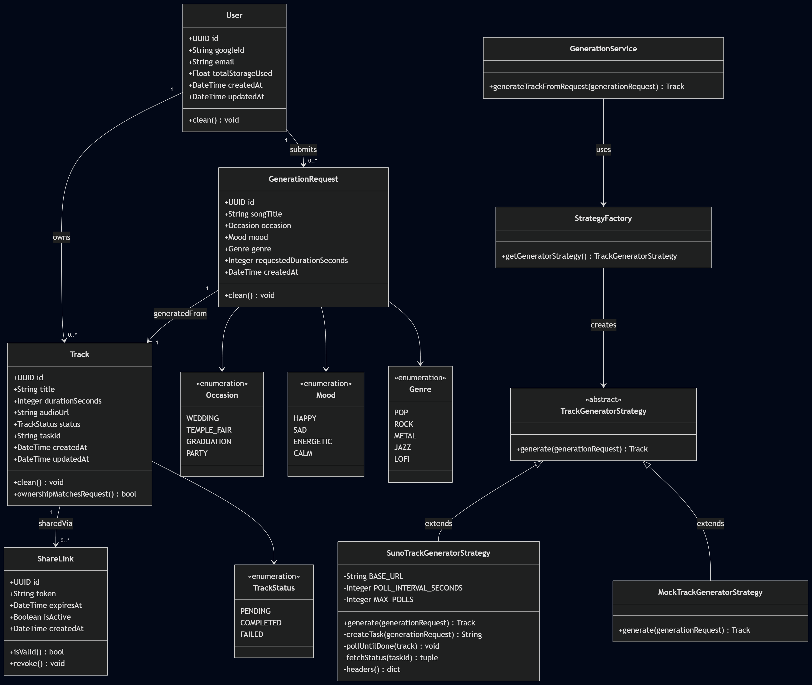
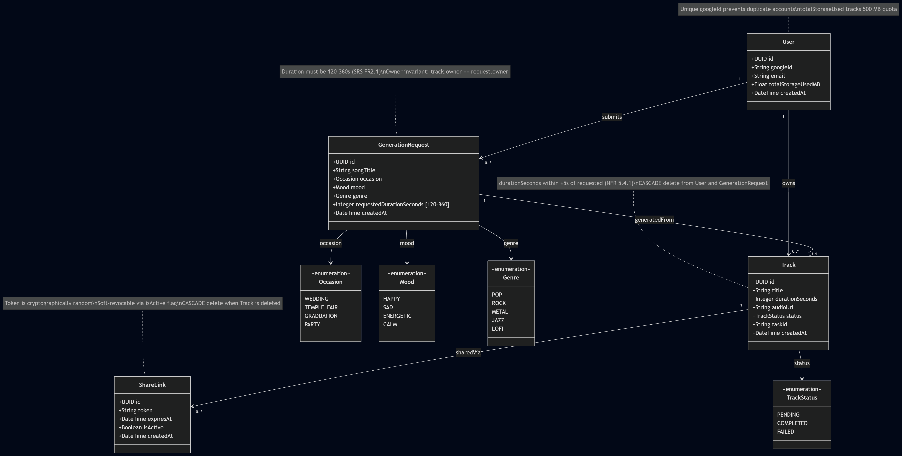
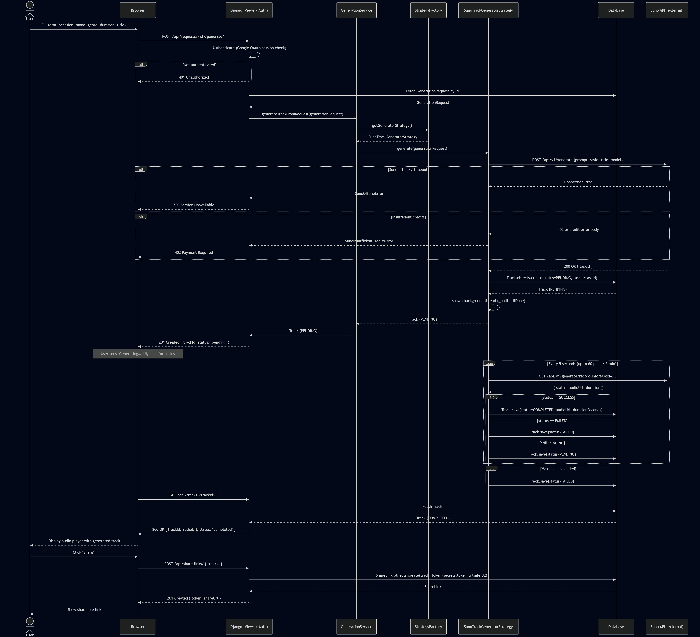

# SoundAI

SoundAI is a Django-based AI music generation platform.
The system supports real song generation via the Suno API and a mock offline strategy for development and testing.

---

**Name:** Watcharapat Pathanutpong
**Student ID:** 6710545881
**Course:** Software Design

---

## Project Overview

The system supports the following core flow:

1. A **User** signs in via Google OAuth.
2. The user submits a **GenerationRequest** (song title, occasion, mood, genre, duration).
3. The system generates a **Track** using the active strategy (mock or Suno API).
4. Generated tracks appear in the user's private library with status tracking (`pending`, `completed`, `failed`).
5. Tracks can be shared via cryptographically random tokens through **ShareLink**.
6. Public share links resolve to a read-only listening page that requires no authentication.
7. An **admin** role (configured via `ADMIN_EMAILS`) is the only role that can browse the global user list; regular users see only their own profile.

---

## Main Features

- **Strategy Pattern** for track generation (mock vs Suno API, swappable via env var)
- **Mock strategy** — offline, deterministic, no API calls required
- **Suno API strategy** — real AI generation via SunoApi.org with background polling
- Google OAuth 2.0 authentication (Authorization Code flow)
- Role-based access (admin vs regular user) controlled by `ADMIN_EMAILS`
- Frontend UI built with Django Templates and Bootstrap 4
- Full JSON REST API alongside the HTML frontend
- Public share-link page with cryptographically random tokens (no login required)
- Admin can browse all users; regular users see only themselves
- Configurable public site URL for absolute share links via `SITE_URL`
- Django admin support

---

## Domain Entities

| Model | Domain Role |
|---|---|
| `User` | Authenticated creator (Google OAuth identity) with storage tracking |
| `GenerationRequest` | Structured AI parameters (Occasion, Mood, Genre, Duration, Title) |
| `Track` | Generated MP3 file with status lifecycle |
| `ShareLink` | Public, non-guessable share token for anonymous track access |

### Enumerations

- **TrackStatus**: `pending`, `completed`, `failed`
- **Occasion**: `wedding`, `temple_fair`, `graduation`, `party`
- **Mood**: `happy`, `sad`, `energetic`, `calm`
- **Genre**: `pop`, `rock`, `metal`, `jazz`, `lofi`

---

## Domain Relationships

- One **User** can have many **GenerationRequests**
- One **User** can have many **Tracks**
- One **GenerationRequest** generates exactly one **Track** (1-to-1)
- One **Track** can have many **ShareLinks**
- Deleting a **User** cascades to their **GenerationRequests** and **Tracks**
- Deleting a **Track** cascades to its **ShareLinks**

---

## Diagrams

All diagrams are stored in the [`diagrams/`](diagrams/) folder.

### Class Diagram (MVT Structure)

Organises every class across Django's Model–View–Template layers, including the Strategy pattern and service layer.



### Domain Model

Shows the core entities, their attributes, enumerations, and relationships with business-rule annotations.



### Sequence Diagram

Illustrates the end-to-end music generation flow: form submission → Suno API → background polling → track completion → share-link creation, including error branches.



---

## Business Rules Enforced

| Rule | Where Enforced |
|------|---------------|
| `google_id` must be unique per user | `unique=True` on `User.google_id` |
| Duration must be 120–360 s (SRS FR2.1) | `MinValueValidator(120)` + `MaxValueValidator(360)` on `GenerationRequest` |
| Track duration within ±5 s of requested (NFR 5.4.1) | `Track.clean()` validation |
| Track deleted when User deleted (Composition) | `ForeignKey(on_delete=CASCADE)` |
| ShareLinks deleted when Track deleted (Orphan Prevention) | `ForeignKey(on_delete=CASCADE)` on `ShareLink.track` |
| Token must be cryptographically random | `secrets.token_urlsafe(32)` default |
| Each Track results from exactly one GenerationRequest | `OneToOneField` on `Track.generation_request` |
| Track owner must match GenerationRequest owner | `Track.ownership_matches_request()` |

---

## Project Structure

```text
SoundAI/
├── manage.py
├── requirements.txt
├── db.sqlite3
├── .env                              ← secrets (not committed)
├── .gitignore
├── README.md
│
├── diagrams/                         ← UML diagrams (MVT class, domain, sequence)
│   ├── class_diagram.png
│   ├── domain_diagram.png
│   └── sequence_diagram.png
│
├── video_demo/                       ← recorded demo videos
│   ├── mock.mkv                      ← mock strategy walkthrough
│   ├── suno1.mkv                     ← Suno generation (part 1)
│   └── suno2.mkv                     ← Suno generation (part 2)
│
├── soundai/                          ← Django project config
│   ├── __init__.py
│   ├── asgi.py
│   ├── settings.py                   ← OAuth, ADMIN_EMAILS, SITE_URL, GENERATOR_STRATEGY
│   ├── urls.py                       ← Frontend + API routing
│   └── wsgi.py
│
└── myapp/
    ├── __init__.py
    ├── admin.py
    ├── apps.py
    ├── tests.py
    ├── urls.py                       ← API endpoints (namespace: 'api')
    ├── context_processors.py         ← injects current_user / is_admin / site_url
    │
    ├── models/                       ← One file per entity
    │   ├── __init__.py
    │   ├── enums.py                  ← TrackStatus, Occasion, Mood, Genre
    │   ├── user.py
    │   ├── generation_request.py
    │   ├── track.py
    │   └── share_link.py
    │
    ├── views/
    │   ├── __init__.py
    │   ├── helpers.py                ← parse_json_body, validation_error_response
    │   ├── auth_views.py             ← Google OAuth flow
    │   ├── frontend_views.py         ← HTML pages (home, tracks, requests, users, …)
    │   ├── generation_views.py       ← POST /api/requests/<id>/generate/
    │   ├── generation_request_views.py
    │   ├── track_views.py
    │   ├── share_link_views.py
    │   └── user_views.py
    │
    ├── services/
    │   ├── __init__.py
    │   └── generation_service.py     ← thin façade over the active strategy
    │
    ├── strategies/                   ← Strategy Pattern
    │   ├── __init__.py
    │   ├── base.py                   ← Abstract TrackGeneratorStrategy interface
    │   ├── factory.py                ← Centralized strategy selection
    │   ├── mock_strategy.py          ← Offline mock implementation
    │   ├── suno_strategy.py          ← Suno API implementation (background polling)
    │   └── exceptions.py             ← SunoOfflineError, SunoInsufficientCreditsError
    │
    ├── templates/
    │   ├── base.html                 ← navbar, auth state, admin badge
    │   ├── login.html                ← Google sign-in button
    │   ├── home.html                 ← generate form + recent tracks
    │   ├── track_list.html
    │   ├── track_detail.html
    │   ├── request_list.html
    │   ├── request_detail.html
    │   ├── user_list.html            ← admin-only
    │   ├── user_detail.html
    │   ├── sharelink_list.html
    │   ├── sharelink_detail.html
    │   └── public_share.html         ← anonymous share viewer
    │
    └── migrations/
        ├── 0001_initial.py
        ├── 0002_add_task_id_to_track.py
        └── 0003_add_song_title_to_generation_request.py
```

---

## Installation and Setup

### 1. Clone the repository

```bash
git clone https://github.com/Watcharapat-P/SoundAI.git
cd SoundAI
```

### 2. Create and activate a virtual environment

#### Windows

```bash
python -m venv venv
venv\Scripts\activate
```

#### macOS / Linux

```bash
python3 -m venv venv
source venv/bin/activate
```

### 3. Install dependencies

```bash
pip install -r requirements.txt
```

`requirements.txt` includes Django, python-dotenv, and the `requests` library used by both the Suno strategy and the OAuth flow.

### 4. Create a `.env` file

Copy the example below and fill in your own values:

```env
# Django
DEBUG=True
SECRET_KEY=django-insecure-change-me
ALLOWED_HOSTS=localhost,127.0.0.1

# Generation
GENERATOR_STRATEGY=mock                # "mock" or "suno"
SUNO_API_KEY=your_suno_api_key
SUNO_CALLBACK_URL=http://localhost:8000/generation/suno/callback/

# Google OAuth (from Google Cloud Console)
GOOGLE_CLIENT_ID=your_google_client_id
GOOGLE_CLIENT_SECRET=your_google_client_secret

# Public site URL — used to build absolute share-link URLs (no trailing slash)
SITE_URL=http://localhost:8000

# Admin emails (comma-separated). Only these users can see the global user list.
ADMIN_EMAILS=your.email@gmail.com
```

> Never commit `.env` — it contains secrets. It is already listed in `.gitignore`.

### 4a. Google OAuth Setup

1. Go to [Google Cloud Console](https://console.cloud.google.com/)
2. Create a project → **APIs & Services** → **Credentials**
3. Click **Create Credentials** → **OAuth 2.0 Client ID**
4. Application type: **Web application**
5. Add to **Authorized redirect URIs** (both, for `localhost` and `127.0.0.1`):
   ```
   http://127.0.0.1:8000/auth/google/callback/
   http://localhost:8000/auth/google/callback/
   ```
6. Copy the **Client ID** and **Client Secret** into your `.env`.
7. The trailing slash is required — Google performs an exact-string match.

### 5. Apply migrations

```bash
python manage.py migrate
```

### 6. Create a superuser (for Django Admin)

```bash
python manage.py createsuperuser
```

### 7. Run the application

```bash
python manage.py runserver
```

### 8. Open the application

* Main page: `http://127.0.0.1:8000/`
* Login page: `http://127.0.0.1:8000/login/`
* Django admin: `http://127.0.0.1:8000/admin/`

---

## Strategy Pattern: Track Generation

This project implements the **Strategy design pattern** so that the song generation behavior is swappable without changing controllers, services, or any view logic.

### Strategy Interface

Defined in `myapp/strategies/base.py`:

```python
class TrackGeneratorStrategy(ABC):
    @abstractmethod
    def generate(self, generation_request) -> Track:
        ...
```

Both strategies implement the same interface and return a `Track` instance.

---

### Running in Mock Mode (Offline)

Set in your `.env`:

```env
GENERATOR_STRATEGY=mock
```

Restart the server. Mock mode produces a deterministic Track with a fixed placeholder MP3. No API key or network connection required.

**Example log output:**

```
[MockStrategy] Created track 158102af-77e3-44f9-a69f-9094d44b9ed5 for request c048618b-2c46-4d34-9745-e8b67e288c90
Track created:
  id       = 158102af-77e3-44f9-a69f-9094d44b9ed5
  title    = 'Eternal Bloom'
  status   = completed
  audio_url= https://www.soundhelix.com/examples/mp3/SoundHelix-Song-1.mp3
  task_id  = ''
  ✓ Mock generation PASSED
```

---

### Running in Suno Mode (Live API)

Set in your `.env`:

```env
GENERATOR_STRATEGY=suno
SUNO_API_KEY=your_suno_api_key
SUNO_CALLBACK_URL=http://localhost:8000/generation/suno/callback/
```

Restart the server. Suno mode:

1. Calls `POST https://api.sunoapi.org/api/v1/generate` with a Bearer token and a JSON payload (including the required `callBackUrl`).
2. Stores the returned `taskId` on a Track in `pending` status.
3. Spawns a background thread that polls `GET https://api.sunoapi.org/api/v1/generate/record-info` every 5 seconds (max 5 minutes) and updates the Track to `completed` (with a real `audio_url` and `duration_seconds`) or `failed`.

**Example log output:**

```
[SunoStrategy] Generation task created: taskId=abc123xyz
[SunoStrategy] Task abc123xyz started – Track <uuid> is PENDING.
[SunoStrategy] Poll 1: task=abc123xyz status=PENDING
[SunoStrategy] Poll 2: task=abc123xyz status=TEXT_SUCCESS
[SunoStrategy] Poll 4: task=abc123xyz status=SUCCESS
```

Polling is used instead of relying on the Suno callback — the API still requires a `callBackUrl` field in the request body, but our app ignores any callbacks pushed to it. If you want to use real callbacks, expose your local server with `ngrok http 8000` and point `SUNO_CALLBACK_URL` at the public URL.

---

### Suno API Key Setup

The Suno API key must **never be committed** to the repository.

1. The `.env` file is already in `.gitignore`.
2. Add your key to `.env`: `SUNO_API_KEY=your_key_here`.
3. Obtain a key from [sunoapi.org](https://sunoapi.org).

`settings.py` reads it as:

```python
SUNO_API_KEY = os.environ.get("SUNO_API_KEY", "")
```

---

### Strategy Selection

Selection is centralized in `myapp/strategies/factory.py`:

```python
def get_generator_strategy() -> TrackGeneratorStrategy:
    strategy_name = getattr(settings, "GENERATOR_STRATEGY", "mock").lower()
    if strategy_name == "suno":
        from .suno_strategy import SunoTrackGeneratorStrategy
        return SunoTrackGeneratorStrategy()
    from .mock_strategy import MockTrackGeneratorStrategy
    return MockTrackGeneratorStrategy()
```

No `if/else` on the strategy name exists anywhere else in the codebase. The home view, the JSON API endpoint at `POST /api/requests/<id>/generate/`, and any future caller all go through the same `generate_track_from_request()` service in `myapp/services/generation_service.py`.

---

## Authentication & Authorization

### Google OAuth Flow

Implemented in `myapp/views/auth_views.py`:

1. `/login/` — renders the login page with a "Sign in with Google" button.
2. `/auth/google/` — generates a cryptographically random `state` (CSRF token), stores it in the session, and redirects to Google's consent screen.
3. `/auth/google/callback/` — validates `state`, exchanges the authorization `code` for tokens, fetches the Google profile, upserts the local `User` keyed on `google_id`, and stores `user_id`, `user_email`, `user_name`, `user_picture` in the session.
4. `/logout/` — flushes the session.

A `current_user` context processor exposes the session user (and an `is_admin` flag, and `site_url`) to every template.

### Roles

Two roles are recognized:

| Role | Visible nav links | Access |
|---|---|---|
| **Anonymous** | Home only | Can view `/` (recent tracks) and the public `/s/<token>/` pages. Everything else redirects to `/login/`. |
| **Regular user** | Home, My Tracks, Requests, **My Profile** | Sees only their own tracks, requests, and profile. Visiting another user's profile redirects back to their own. |
| **Admin** | Home, My Tracks, Requests, **Users** + red `ADMIN` badge | Sees the global user list and can open any profile. |

Admin status is determined entirely by the `ADMIN_EMAILS` env var (comma-separated list). To grant admin access:

```env
ADMIN_EMAILS=alice@example.com,bob@example.com
```

---

## Route Structure

### Frontend (HTML)

| URL | Description |
|---|---|
| `/` | Home — generate form (signed-in) + recent tracks |
| `/login/` | Sign-in page |
| `/auth/google/` → `/auth/google/callback/` | Google OAuth flow |
| `/logout/` | Clear session |
| `/tracks/` | List the signed-in user's tracks |
| `/tracks/<uuid>/` | Track detail with audio player |
| `/requests/` | List the signed-in user's generation requests |
| `/requests/<uuid>/` | Generation request detail |
| `/users/` | **Admin only** — global user list |
| `/users/<uuid>/` | User profile (own profile, or any if admin) |
| `/share-links/` | Create / list share links (and revoke) |
| `/share-links/<uuid>/` | Share-link detail with copyable URL |
| `/s/<token>/` | **Public** anonymous track viewer |

### JSON API (namespace `api`)

Reachable as `` etc. and live at `/api/...`:

| Method | URL | Description |
|---|---|---|
| GET/POST | `/api/users/` | List / create users |
| GET/PATCH/DELETE | `/api/users/<id>/` | Retrieve / update / delete user |
| GET/POST | `/api/requests/` | List / create generation requests |
| GET/DELETE | `/api/requests/<id>/` | Retrieve / delete request |
| POST | `/api/requests/<id>/generate/` | Trigger generation via active strategy |
| GET/POST | `/api/tracks/` | List / create tracks |
| GET/PATCH/DELETE | `/api/tracks/<id>/` | Retrieve / update / delete track |
| GET/POST | `/api/share-links/` | List / create share links |
| GET/DELETE | `/api/share-links/<id>/` | Retrieve / delete share link |
| POST | `/api/share-links/<id>/revoke/` | Soft-revoke a share link |
| GET | `/api/s/<token>/` | Public track access (no auth) |

The API endpoints are namespaced under `app_name = 'api'` so they don't collide with the frontend URL names (which use the same labels: `track-list`, `user-list`, etc.).

**Example — create a generation request via API:**

```bash
curl -X POST http://127.0.0.1:8000/api/requests/ \
  -H "Content-Type: application/json" \
  -d '{
    "owner_id": "<user-uuid>",
    "occasion": "wedding",
    "mood": "happy",
    "genre": "pop",
    "requested_duration_seconds": 180
  }'
```

**Example — trigger generation:**

```bash
curl -X POST http://127.0.0.1:8000/api/requests/<request-uuid>/generate/
```

The Postman collection is available here:
<https://www.postman.com/test3858/workspace/soundai/collection/47929779-a843ebf5-f614-49a3-a121-b377950544af>

---

## Mock Track Generation

When `GENERATOR_STRATEGY=mock`, the system creates a deterministic `Track` using a fixed placeholder audio URL (`https://www.soundhelix.com/examples/mp3/SoundHelix-Song-1.mp3`) and marks it `completed` immediately. No external API is called.

This allows full end-to-end testing — including playback, share-link generation, and the public share page — without a Suno API key or network access.

---

## Share Logic

Each **ShareLink** stores an auto-generated token created with `secrets.token_urlsafe(32)`. The application derives the public URL from `SITE_URL` plus the token rather than storing the full URL in the database, so changing the deployed host only requires updating `SITE_URL` in `.env`.

A share link can be **revoked** without deleting it (soft delete via `is_valid=False`), which immediately blocks the public `/s/<token>/` page from loading.

---

## Configuration Summary

All environment-driven behavior is centralized in `soundai/settings.py`:

| Variable | Default | Purpose |
|---|---|---|
| `GENERATOR_STRATEGY` | `mock` | Selects the active strategy (`mock` or `suno`) |
| `SUNO_API_KEY` | `""` | Bearer token for SunoApi.org |
| `SUNO_CALLBACK_URL` | `""` | Required field in the Suno generate payload (we use polling, not the callback) |
| `GOOGLE_CLIENT_ID` | `""` | OAuth client ID from Google Cloud Console |
| `GOOGLE_CLIENT_SECRET` | `""` | OAuth client secret from Google Cloud Console |
| `SITE_URL` | `http://localhost:8000` | Base URL prepended to share links |
| `ADMIN_EMAILS` | (your email) | Comma-separated list of emails granted admin access |

---

## Future Improvements

- Persist Suno callback handling end-to-end (currently we ignore the callback and rely on polling)
- Listener access tracking for shared tracks
- Bulk track export and library organisation
- More granular pricing / credit ledger per generation length
- Move admin role into the database instead of an env-driven email list

---

## Notes

- Authentication implemented via custom Google OAuth 2.0 flow (no third-party auth library required).
- Real AI generation implemented via the Suno API strategy with background polling.
- Frontend UI implemented with Django Templates and Bootstrap 4.
- Strategy selection controlled entirely by the `GENERATOR_STRATEGY` env var — no scattered `if/else`.
- The `.env` file must never be committed; it contains secrets.
- Admin access is controlled by `ADMIN_EMAILS` — change it any time without redeploying code.

---
